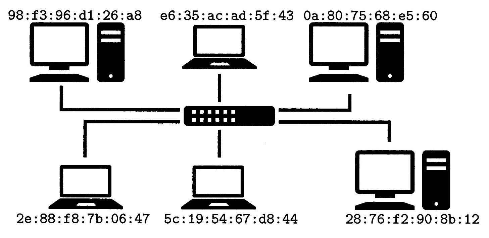

### La couche de liaison et le protocole Ethernet

La couche la plus basse du modèle Internet regroupe tous les aspects physiques du réseau. Ici, on ne considère comme faisant partie d’un même réseau que des machines reliées directement entre elles par la même technologie.

Par exemple, il peut s’agir d’un réseau Wi-Fi ou d’un réseau câblé utilisant le protocole Ethernet. On parle alors de réseau local ou LAN (pour l'anglais Local Area Network, réseau de zone locale).

La figure suivante illustre
un tel réseau:

Dans un réseau local de type Ethernet, chaque interface matérielle (chaque carte réseau pour simplifier) possède une adresse sur 48 bits (soit 6 octets) dite adresse MAC. Ces adresses sont traditionnellement données en hexadécimal en séparant chaque octet. Chaque ordinateur possède une carte réseau et une adresse MAC associée. Les ordinateurs sont reliés par un périphérique réseau faisant office de « multi-prise ». La nature exacte de ce périphérique a évolué au cours des années.

Lors de son introduction au début des années 1980, Ethernet était pensé selon une logique de bus, c’est-à-dire que chaque machine était reliée à un câble coaxial commun. Dans ce modèle lorsqu'une machine (par exemple celle avec l’adresse 98:f3:96:41:26:a8) souhaite communiquer avec une autre (par exemple celle avec l’adresse 28:76:f2:90:8b:12), elle envoie sur son câble un paquet d’octets appelé trame Ethernet. Cette trame est structurée de la manière suivante.

<table style="text-align:center">
    <thead>
        <tr>
            <th >préfixe</th>
            <th >adresse destination</th>
            <th >adresse source</th>
            <th >longueur</th>
            <th >données</th>
            <th >suffixe</th>
        </tr>
    </thead>
    <tbody>
        <tr>
            <td >8 octets</td>
            <td >6 octets</td>
            <td >6 octets</td>
            <td >2 octets</td>
            <td >longueur octets</td>
            <td >16 octets</td>
        </tr>
    </tbody>
</table>

La trame
* commence par une certaine séquence d’octets (qu’on ne détaille pas) et
* contient ensuite l'adresse MAC de la machine de destination ainsi que celle de la machine source ;
* suit alors la taille des données que l’on souhaite envoyer,
* puis les données elles-mêmes ;
* la trame se termine enfin par une autre séquence d’octets de contrôle (qu’on ne détaille pas non plus).

Dans ce mode de fonctionnement en bus, toutes les machines du réseau local reçoivent la trame (le concentrateur réplique le signal électrique sur tous les câbles). Toutes les machines autres que la machine de destination ignorent la trame et seule la machine dont l’adresse MAC est présente dans la trame accepte la trame et récupère les données. Une autre caractéristique du protocole est qu’à un moment donné, une seule machine peut émettre à la fois. Si deux machines émettent des trames sur la même période, les signaux se mélangent et il y à une collision. Elles doivent donc ré-émettre leurs données. La relative simplicité de ce protocole a permis son adoption rapide.

Ce protocole subit une évolution majeure en 1989 avec l'apparition de l’Ethernet commuté. Dans cette version du protocole, le câble commun est remplacé par un commutateur (appelé switch en anglais). Le commutateur embarque des circuits électroniques lui permettant de découvrir l’adresse MAC de la machine associée à chacune de ses prises. Lorsqu'il reçoit une trame, il peut donc l’envoyer uniquement sur le câble correspondant à l’adresse MAC de destination. Cette évolution du protocole a permis d'atteindre des débits importants (de l’ordre de 100 Mbit/s initialement puis encore plus grâce à d’autres évolutions techniques).

Malgré sa relative ancienneté, Ethernet est encore de nos jours la technologie filaire la plus utilisée pour les particuliers ou les entreprises (les hébergeurs ou les fournisseurs d’accès, utilisent d’autres technologies permettant des débits encore plus importants, par exemple basées sur de la fibre optique).

