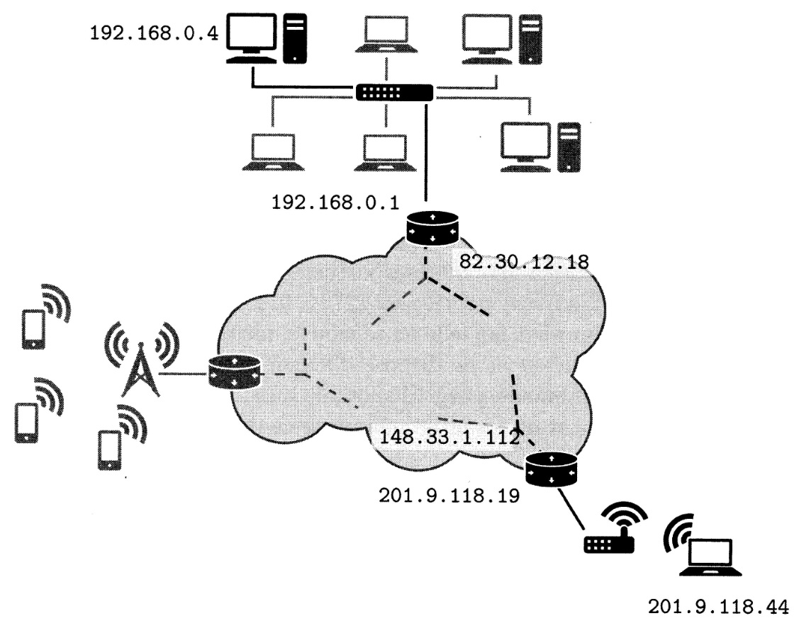

### La couche de liaison et le protocole Ethernet

La couche la plus basse du modèle Internet regroupe tous les aspects physiques du réseau. Ici, on ne considère comme faisant partie d’un même réseau que des machines reliées directement entre elles par la même technologie.

Par exemple, il peut s’agir d’un réseau Wi-Fi ou d’un réseau câblé utilisant le protocole Ethernet. On parle alors de réseau local ou LAN (pour l'anglais Local Area Network, réseau de zone locale).

La figure suivante illustre
un tel réseau:


Dans un réseau local de type Ethernet, chaque interface matérielle (chaque carte réseau pour simplifier) possède une adresse sur 48 bits (soit 6 octets) dite adresse MAC. Ces adresses sont traditionnellement données en hexadécimal en séparant chaque octet. Chaque ordinateur possède une carte réseau et une adresse MAC associée. Les ordinateurs sont reliés par un périphérique réseau faisant office de « multi-prise ». La nature exacte de ce périphérique a évolué au cours des années.

Lors de son introduction au début des années 1980, Ethernet était pensé selon une logique de bus, c’est-à-dire que chaque machine était reliée à un câble coaxial commun. Dans ce modèle lorsqu'une machine (par exemple celle avec l’adresse 98:f3:96:41:26:a8) souhaite communiquer avec une autre (par exemple celle avec l’adresse 28:76:f2:90:8b:12), elle envoie sur son câble un paquet d’octets appelé trame Ethernet. Cette trame est structurée de la manière suivante.

<table style="text-align:center">
    <thead>
        <tr>
            <th >préfixe</th>
            <th >adresse destination</th>
            <th >adresse source</th>
            <th >longueur</th>
            <th >données</th>
            <th >suffixe</th>
        </tr>
    </thead>
    <tbody>
        <tr>
            <td >8 octets</td>
            <td >6 octets</td>
            <td >6 octets</td>
            <td >2 octets</td>
            <td >longueur octets</td>
            <td >16 octets</td>
        </tr>
    </tbody>
</table>


La trame
* commence par une certaine séquence d’octets (qu’on ne détaille pas) et
* contient ensuite l'adresse MAC de la machine de destination ainsi que celle de la machine source ;
* suit alors la taille des données que l’on souhaite envoyer,
* puis les données elles-mêmes ;
* la trame se termine enfin par une autre séquence d’octets de contrôle (qu’on ne détaille pas non plus).

Dans ce mode de fonctionnement en bus, toutes les machines du réseau local reçoivent la trame (le concentrateur réplique le signal électrique sur tous les câbles). Toutes les machines autres que la machine de destination ignorent la trame et seule la machine dont l’adresse MAC est présente dans la trame accepte la trame et récupère les données. Une autre caractéristique du protocole est qu’à un moment donné, une seule machine peut émettre à la fois. Si deux machines émettent des trames sur la même période, les signaux se mélangent et il y à une collision. Elles doivent donc ré-émettre leurs données. La relative simplicité de ce protocole a permis son adoption rapide.

Ce protocole subit une évolution majeure en 1989 avec l'apparition de l’Ethernet commuté. Dans cette version du protocole, le câble commun est remplacé par un commutateur (appelé switch en anglais). Le commutateur embarque des circuits électroniques lui permettant de découvrir l’adresse MAC de la machine associée à chacune de ses prises. Lorsqu'il reçoit une trame, il peut donc l’envoyer uniquement sur le câble correspondant à l’adresse MAC de destination. Cette évolution du protocole a permis d'atteindre des débits importants (de l’ordre de 100 Mbit/s initialement puis encore plus grâce à d’autres évolutions techniques).

Malgré sa relative ancienneté, Ethernet est encore de nos jours la technologie filaire la plus utilisée pour les particuliers ou les entreprises (les hébergeurs ou les fournisseurs d’accès, utilisent d’autres technologies permettant des débits encore plus importants, par exemple basées sur de la fibre optique).

### La couche Internet et le protocole IP

Une fois que l’on possède un ensemble de machines reliées physiquement et formant un réseau local, il est naturel d’imaginer comment relier différents réseaux locaux pour permettre à deux machines, positionnées sur deux réseaux physiquement différents de communiquer.

Cette problématique est résolue par le protocole IP (pour l’anglais Internet Protocol). Ce dernier offre plusieurs fonctionnalités.

* En premier lieu, il permet d’associer à chaque interface de chaque machine un identifiant unique appelé adresse IP, indépendamment de la couche de liaison sous-jacente. Nous utilisons dans la suite la version 4 du protocole (IPv4) qui est la plus ancienne, mais est sensiblement plus simple. Dans cette version du protocole, l'adresse IP est représentée par 4 octets, usuellement notés en décimal (donc entre 0 et 255 chacun) et séparés par des points, par exemple « 149.56.108.199 ». Chaque machine connectée à un réseau IP (que ce soit un réseau local de quelques machines ou au réseau Internet) possède une ou plusieurs adresses IP qui permettent de les contacter. Généralement, une machine possède une adresse IP par interface.

* Le protocole IP définit aussi pour toutes les machines une adresse spéciale, reliée à une interface virtuelle appelée localhost (en français l’hôte local). L'adresse associée est 127.0.0.1. Cette adresse correspond toujours à la machine sur laquelle on se trouve, même si cette dernière n’est pas connectée à Internet et ne dispose d'aucun périphérique réseau.

Dans un terminal, la commande ping (disponible aussi bien sous système Unix que Windows) permet de tester qu’une machine distante est bien accessible
depuis notre machine.

```
$ ping 149.56.108.199

PING 149.56.108.199 (149.56.108.199) 56(84) bytes of data.
64 bytes from 149.56.108.199: icmp_seq=1 tt1=46 time=90.8 ms
64 bytes from 149.56.108.199: icmp_seq=2 tt1=46 time=91.3 ms
64 bytes from 149.56.108.199: icmp_seq=3 tt1=46 time=115 ms
^C

--- 149.56.108.199 ping statistics ---
3 packets transmitted, 3 received, 0% packet loss, time 6ms
rtt min/avg/max/mdev = 90.755/99.086/115.168/11.374 ms
```

La commande envoie à la machine dont l’adresse IP est donnée un petit paquet de données.

* Si la machine visée est connectée, elle répond par un petit paquet de réponse. La commande répète cette opération toutes les secondes (jusqu’à ce qu’elle soit interrompue avec (CTRL C).

* Chaque paquet envoyé est numéroté (champ icmp_seq) et l’heure d'envoi est mémorisée. Lorsque une réponse parvient, elle contient aussi un numéro d’envoi. En comparant les numéros d’envoi, la commande peut déterminer si un paquet n’a pas eu de réponse et a donc été perdu.

* Si aucun paquet ne revient, c'est qu’il y a un problème de connexion entre notre machine et la machine distante (soit la machine distante n’est pas connectée, soit notre propre machine n’est pas connectée, soit une machine ou un lien quelque part entre les deux est défaillant).

* Si certains paquets reviennent mais pas d’autres, c’est que la connexion est de mauvaise qualité (par exemple interférence à côté d’un réseau Wi-Fi). Le temps de réponse permet aussi de determiner la qualité de la connexion.

Le deuxième rôle du protocole IP est le **routage**, i.e. la transmission de proche en proche des données depuis l’émetteur jusqu’à la destination finale. En effet, toutes les machines du réseau n'étant pas directement connectées les unes aux autres, le protocole permet de définir comment acheminer les données.

Pour cela, il définit d’abord la notion de sous-réseau.
Un **sous-réseau IP** est un ensemble de machines toutes connectées et donc toutes accessibles directement. Elles doivent donc être (en simplifiant) toutes sur le même réseau local. Parmi ces machines, au moins une joue un rôle particulier : c’est une **passerelle** (en anglais gateway). On rencontre aussi le terme de routeur. Une passerelle est une machine possédant au moins deux interfaces réseau. Chacune est connectée physiquement à un sous-réseau différent. La passerelle possède une **table de routage**, c’est-à-dire la liste des adresses joignables depuis cette interface pour chacune des interfaces réseau qu'elle possède.

Lorsqu'une machine envoie un paquet de données à une autre machine, elle regarde l’adresse de destination.
* Si c’est une adresse du sous-réseau, elle envoie directement la donnée. Sinon, elle envoie le paquet de données à sa passerelle par défaut. La passerelle par défaut regarde alors l'adresse de destination.
* Si c’est une adresse de son deuxième sous-réseau elle l'envoie à la machine concernée. Sinon elle l’envoie à une deuxième passerelle se trouvant sur le deuxième sous-réseau qui se chargera de la transmettre, et ainsi de suite jusqu’à la destination finale.

Ce fonctionnement est illustré à la figure suivante:



Dans cette figure, lorsque la machine d’IP 192.168.0.4 veut envoyer des données à la machine d’IP 201.9.118.44 (qui n’est pas sur le même sous-réseau) elle envoie les données au routeur de son sous-réseau.

Ce dernier reçoit les données sur sa première interface (192.168.0.1) et les propage sur sa seconde interface (82.30.12.18). Les paquets sont ainsi propagés de proche en proche jusqu’à arriver au routeur d’IP 148.33.1.112 qui est le routeur du sous-réseau de la machine visée.

Pour pouvoir mener à bien ce processus de routage, le protocole IP définit la notion de **paquet IP**. Lorsque la machine source souhaite envoyer des données, elle les encapsule dans un paquet IP dont nous décrivons maintenant la structure.

<div>
<table style="text-align:center">
    <thead>
        <tr>
            <th >préfixe</th>
            <th >adresse IP source</th>
            <th >adresse IP destination</th>
            <th >données</th>
        </tr>
    </thead>
    <tbody>
        <tr>
            <td >12 octets</td>
            <td >4 octets</td>
            <td >4 octets</td>
            <td >longueur octets</td>
        </tr>
    </tbody>
</table>
</div>

Sans détailler la nature exacte du préfixe, nous pouvons dire qu’il contient au moins la longueur totale du paquet (incluant les données et l’entête) ainsi qu’un entier sur un octet appelé TTL (pour l’anglais Time To Live ou durée de vie). Si nous revenons à notre exemple en le détaillant, lorsque la machine 192.168.0.4 souhaite envoyer des données, elle les préfixe d’abord par un entête IP, en fixant une certaine durée de vie (par exemple 10). Ce paquet IP est ensuite lui-même encapsulé dans une trame Ethernet et envoyé au routeur 192.168.0.1 (par le protocole Ethernet, sur le réseau local). Ce dernier extrait le paquet IP de la trame Ethernet, décrémente le champ TTL
dans le paquet IP, le ré-encapsule dans une nouvelle trame (dont le format dépend du réseau physique de son interface 82.30.12.18) et le transmet sur cette interface. À chaque routeur rencontré sur le chemin, le paquet IP est extrait de la trame du protocole physique, son TTL est décrémenté et repropagé jusqu’à son arrivée à destination. Si à un moment le TTL prend
la valeur 0, alors le routeur détruit le paquet (il ne le retransmet pas) et le paquet est perdu. Ce mécanisme permet d'éviter que des paquets restent trop longtemps en transfert sur le réseau sans trouver leur destination.

Le dernier aspect que nous détaillons pour le protocole IP est la manière de spécifier un sous-réseau, c’est-à-dire la manière de lister toutes les adresses IP des machines pouvant communiquer directement (sans passer par un routeur). Un sous-réseau est donné par deux adresses IP. L'une sert de base et est appelée adresse de réseau (par exemple 192.168.0.0). L'autre est appelée masque de sous-réseau et consiste en une adresse dont la représentation binaire est de la forme : 1...1 0...0, c’est-à-dire une suite de 1, suivi d’une suite de 0. Par exemple un masque valide est 255.255.248.0 qui correspond à la suite de bits :

<table style="text-align:center">
    <thead>
        <tr>
            <td >binaire</td>
            <td >1111 1111</td>
            <td >1111 1111</td>
            <td >1111 1000</td>
            <td >0000 0000</td>
        </tr>
    </thead>
    <tbody>
        <tr>
            <td >decimal</td>
            <td >255</td>
            <td >255</td>
            <td >248</td>
            <td >0</td>
        </tr>
    </tbody>
</table>

Ce masque permet de « découper » une adresse IP en deux parties. La partie « réseau » (ici les 21 bits de poids forts à 1) et la partie « machine » (les 11 bits de poids faibles à 0). Ce masque permet donc d’avoir, sur le même sous- réseau, 211 adresses distinctes. Pour savoir si deux machines sont sur le même sous-réseau, il suffit de prendre leurs adresses IP et d’effectuer un « et » bit à bit avec le masque. Si les adresses résultantes sont les mêmes, les deux adresses sont sur le même sous-réseau.

Prenons l'exemple de trois adresses IP : 192.168.129.10, 192.168.135.200 et 192.168.145. 1, avec le masque de sous-réseau ci-dessus. Pour savoir lesquelles de ces adresses dénotent des machines du même sous-réseau, on applique le masque à chaque adresse :

<table style="text-align:left">
    <thead>
        <tr>
            <td ></td>
            <td >192.168.129.10</td>
        </tr>
    </thead>
    <tbody>
        <tr>
            <td >&</td>
            <td >255.255.248.0</td>
        </tr>
        <tr>
            <td ></td>
            <td >192.168.128.0</td>
        </tr>
    </tbody>
</table>
<table style="text-align:left">
    <thead>
        <tr>
            <td ></td>
            <td >192.168.135.200</td>
        </tr>
    </thead>
    <tbody>
        <tr>
            <td >&</td>
            <td >255.255.248.0</td>
        </tr>
        <tr>
            <td ></td>
            <td >192.168.128.0</td>
        </tr>
    </tbody>
</table>
<table style="text-align:left">
    <thead>
        <tr>
            <td ></td>
            <td >192.168.145.1</td>
        </tr>
    </thead>
    <tbody>
        <tr>
            <td >&</td>
            <td >255.255.248.0</td>
        </tr>
        <tr>
            <td ></td>
            <td >192.168.144.0</td>
        </tr>
    </tbody>
</table>

Faire le «et » bit à bit avec la valeur 255 (tous les bits à 1) laisse la valeur initiale inchangée.

À l'inverse, faire l’opération avec 0 renvoie toujours le résultat 0.

Le seul calcul complexe est donc celui où l’octet du masque ne vaut ni 255 ni O, ici l’octet 248 qui s’écrit 1111 1000 en base 2. Si on convertit l’octet 129 de la première adresse en base 2, on obtient 1000 0001. L'opération donne donc : 10000001 & 11111000 = 1000 0000 = 128<sub>10</sub>. En faisant ces opérations pour les trois adresses, on remarque que les deux premières donnent le même résultat. Elles dénotent donc des adresses du même sous- réseau. La troisième adresse appartient à un sous-réseau différent.

Dans un réseau IP, le masque fait partie des paramètres de configuration, au même titre que l’adresse IP, et l'adresse du routeur. Tous ces paramètres peuvent être configurés soit automatiquement par le système, soit manuellement par l’administrateur.

### La couche de transport, UDP et TCP

Le protocole IP permet la transmission d’un paquet de données, depuis une machine source vers une machine cible (en routant le paquet par des nœuds intermédiaires). Il permet donc de créer une communication entre deux machines physiques.

D’un point de vue pratique, ce que l’on essaye d'établir est une communication entre deux programmes qui s’exécutent, en particulier entre un client s’exécutant sur un poste client et un serveur s’exécutant sur un serveur physique.

Pour reprendre notre exemple initial, il y a un canal de communication entre le navigateur Web et le serveur Web (le programme qui distribue les pages Web). Mais sur une machine, il y a rarement un seul service réseau. En effet, sur le même ordinateur que notre serveur Web pourraient se trouver un serveur de mails, un serveur de bases de données, etc. Il nous faut donc un moyen d'identifier, pour une adresse IP donnée, avec quel service on souhaite communiquer.

C’est le premier rôle des protocoles de la couche de transport que sont **UDP** (pour User Datagram Protocol) et **TCP** déjà mentionnés. Ces deux protocoles définissent un numéro de port, c’est-à-dire un identifiant numérique associé à un service particulier.

Par exemple, le numéro de port par défaut pour le Web non sûr (protocole HTTP) est le 80, celui pour le Web sécurisé (protocole HTTPS) est le 443. Attention, ce ne sont que des conventions. Un serveur Web peut très bien attendre des connexions sur un tout autre port. Il faudra alors que le navigateur Web qui souhaite se connecter au serveur spécifie ce port.

Le protocole UDP se limite essentiellement à cette fonctionnalité. Lorsqu’une application souhaite communiquer à travers le réseau avec une autre application par le protocole UDP, sur une machine distante, elle spécifie l’adresse IP de la machine distante et le numéro de port sur lequel l’application serveur est en attente de connexion et envoie un datagramme UDP (la spécification du protocole parle de datagramme plutôt que de paquet pour UDP). Le paquet contient un entête (une suite d’octets précédant les aucune notification. Un autre défaut d’UDP est que si une application envoie deux datagrammes l’un à la suite de l’autre, elle n’a aucune garantie que l’application réceptrice les reçoive dans le même ordre.

Le protocole TCP résout ces problèmes grâce à un système d’accusés de réception. Le protocole permet d’envoyer à un programme destination des données de taille arbitraire, dans l’ordre, de détecter les erreurs de transmissions et, si besoin, de retransmettre automatiquement les fragments de données perdus ou corrompus. Lorsqu'un client souhaite se connecter à un  serveur avec le protocole TCP, il initie une mise en place de connexion en trois temps (three way handshake). La figure suivante décrit ce procédé:


* Dans un premier temps, le client choisit un numéro de séquence aléatoire (1234 dans la figure). Il envoie ensuite au serveur un paquet étiqueté SYN (synchronized, pour synchronisation) indiquant le numéro choisi.
* Le serveur, sur réception de ce paquet choisit lui aussi un numéro aléatoire (ici 201) et renvoie un paquet SYN-ACK (synchronized-acknowledgement, pour synchronisation et accusé de réception), contenant le numéro de séquence du client incrémenté et le numéro du serveur (ici 1235 et 201).
* Sur réception de ce paquet, le client est considéré comme connecté. Il renvoie un dernier paquet ACK au serveur contenant les numéros de séquences incrémentés de nouveau (donc 1236 et 202).
* Sur réception de ce dernier paquet, le serveur est considéré comme connecté au client.

Tout ce processus permet au client et au serveur de se mettre d’accord sur deux numéros qu’ils choisissent l’un et l’autre. En cas de problème de connexion (par exemple si le client ne reçoit pas le paquet SYN-ACK après un certain temps) client et serveur peuvent essayer de ré-émettre les paquets. Si la ré-émission échoue, la connexion échoue et le client ne peut pas se connecter au serveur. Si la mise en place réussit, alors le serveur et le client partagent une information commune (la paire de numéros de séquence).

 Ils peuvent maintenant garantir des échanges sans perte d’information et de taille arbitraire. Nous illustrons cela sur l'exemple (simplifié) d’un client souhaitant envoyer 3000 octets au serveur. On suppose que les numéros de séquence sont tels que dans la figure précédente en fin de connexion : le numéro de séquence client vaut 1236 et le numéro de séquence serveur vaut 202. Le client peut choisir (pour des raisons matérielles ou de performance) de découper les 3000 octets en trois paquets de 1000 octets, P<sub>1</sub>, P<sub>2</sub> et P<sub>3</sub>. Il envoie donc au serveur trois paquets l’un à la suite de l’autre, en augmentant le numéro de séquence client de la taille du paquet. Le client envoie donc (P<sub>1</sub>, 1236), (P<sub>2</sub>, 2236) et (P<sub>3</sub>,3336). Le serveur renvoie
en réponse des paquets ACK étiquetés par les numéros correspondant (1236,2236 et 3336). Cela permet d’effectuer des vérifications :

* Si le serveur reçoit les trois paquets dans le désordre, il peut les réordonner selon leur numéro croissant et reconstruire le groupe initial de
3000 octets.

* Si le serveur ne reçoit pas le paquet 2236, il n’envoie pas le ACK correspondant. Le client ne recevant pas le ACK , il peut choisir de ré-émettre
uniquement le paquet correspondant à P<sub>2</sub>».

* Si le serveur reçoit des paquets en double (par exemple parce que le client a ré-émis un paquet dont l’original est arrivé entre temps) alors il peut détruire les paquets ayant le même numéro de séquence.

Ce processus relativement simple permet de réaliser un canal de communication avec détection d’erreurs au-dessus du protocole IP. Il illustre aussi l'intérêt du découpage des données en paquets, qui permettent de ne retransmettre que les parties perdues et non pas l'intégralité du message.

### DNS, l'annuaire d'Internet

En conclusion de cette présentation des réseaux, nous décrivons le système de résolution de noms (ou DNS pour Domain Name System), qui est un protocole de la couche d'application. Ce dernier (qui utilise en général UDP sur le port 53, mais peut aussi utiliser TCP) permet de maintenir des annuaires pour faire correspondre des noms symboliques, facilement utilisables par les humains, à des adresses IP. En effet, comme on l’a vu dans les paragraphes précédents, le seul moyen d'identifier une machine sur le réseau est son adresse IP.

Que se passe-t-il alors lorsque l’on indique au navigateur Web que l’on souhaite se connecter au site wuw.nsi-premiere.fr ? Les **serveurs DNS** sont un ensemble de serveurs hiérarchisés agissant comme des annuaires.

* Au sommet de la hiérarchie existent des serveurs dits « racines ». Ces derniers connaissent les serveurs à contacter pour les domaines de premier niveau (ou TLD pour l’anglais Top Level Domain). Ces derniers correspondent au .fr, .com, .edu, .net et toutes les autres extensions possibles.

* Les serveurs DNS des domaines de premier niveau connaissent l'adresse des serveurs contenant les adresses des domaines de second niveau (dans notre exemple nsi-premiere est le domaine de second niveau).

* Ces derniers permettent ensuite de contacter les serveurs connaissant les adresses des sous-domaines (dans notre exemple, www est le sous-domaine).

En pratique, lorsque l’on configure une connexion IP sur un ordinateur, on définit aussi l’adresse de serveurs DNS (par exemple ceux du fournisseur d’accès à Internet). Ces derniers agissent comme un « cache » :
* lorsqu'une machine leur demande l'IP pour un nom de domaine, ils la renvoient directement s’ils la connaissent déjà.
* Sinon, ils procèdent à la requête récursive décrite plus haut (en décomposant le nom demandé), puis une fois la réponse obtenue, ils mémorisent l’IP du nom de domaine complet pour pouvoir répondre plus rapidement aux prochaines requêtes.
