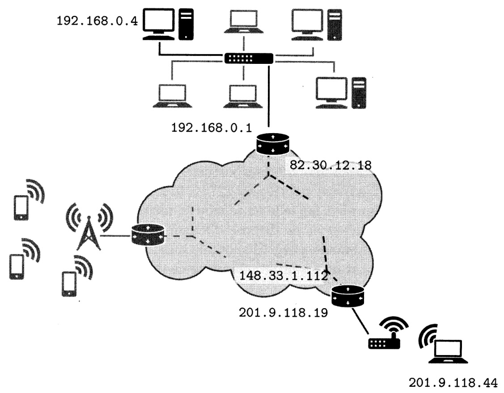

### La couche Internet et le protocole IP

Une fois que l’on possède un ensemble de machines reliées physiquement et formant un réseau local, il est naturel d’imaginer comment relier différents réseaux locaux pour permettre à deux machines, positionnées sur deux réseaux physiquement différents de communiquer.

Cette problématique est résolue par le protocole IP (pour l’anglais Internet Protocol). Ce dernier offre plusieurs fonctionnalités.

* En premier lieu, il permet d’associer à chaque interface de chaque machine un identifiant unique appelé adresse IP, indépendamment de la couche de liaison sous-jacente. Nous utilisons dans la suite la version 4 du protocole (IPv4) qui est la plus ancienne, mais est sensiblement plus simple. Dans cette version du protocole, l'adresse IP est représentée par 4 octets, usuellement notés en décimal (donc entre 0 et 255 chacun) et séparés par des points, par exemple « 149.56.108.199 ». Chaque machine connectée à un réseau IP (que ce soit un réseau local de quelques machines ou au réseau Internet) possède une ou plusieurs adresses IP qui permettent de les contacter. Généralement, une machine possède une adresse IP par interface.

* Le protocole IP définit aussi pour toutes les machines une adresse spéciale, reliée à une interface virtuelle appelée localhost (en français l’hôte local). L'adresse associée est 127.0.0.1. Cette adresse correspond toujours à la machine sur laquelle on se trouve, même si cette dernière n’est pas connectée à Internet et ne dispose d'aucun périphérique réseau.

Dans un terminal, la commande ping (disponible aussi bien sous système Unix que Windows) permet de tester qu’une machine distante est bien accessible
depuis notre machine.

```
$ ping 149.56.108.199

PING 149.56.108.199 (149.56.108.199) 56(84) bytes of data.
64 bytes from 149.56.108.199: icmp_seq=1 tt1=46 time=90.8 ms
64 bytes from 149.56.108.199: icmp_seq=2 tt1=46 time=91.3 ms
64 bytes from 149.56.108.199: icmp_seq=3 tt1=46 time=115 ms
^C

--- 149.56.108.199 ping statistics ---
3 packets transmitted, 3 received, 0% packet loss, time 6ms
rtt min/avg/max/mdev = 90.755/99.086/115.168/11.374 ms
```

La commande envoie à la machine dont l’adresse IP est donnée un petit paquet de données.

* Si la machine visée est connectée, elle répond par un petit paquet de réponse. La commande répète cette opération toutes les secondes (jusqu’à ce qu’elle soit interrompue avec (CTRL C).

* Chaque paquet envoyé est numéroté (champ icmp_seq) et l’heure d'envoi est mémorisée. Lorsque une réponse parvient, elle contient aussi un numéro d’envoi. En comparant les numéros d’envoi, la commande peut déterminer si un paquet n’a pas eu de réponse et a donc été perdu.

* Si aucun paquet ne revient, c'est qu’il y a un problème de connexion entre notre machine et la machine distante (soit la machine distante n’est pas connectée, soit notre propre machine n’est pas connectée, soit une machine ou un lien quelque part entre les deux est défaillant).

* Si certains paquets reviennent mais pas d’autres, c’est que la connexion est de mauvaise qualité (par exemple interférence à côté d’un réseau Wi-Fi). Le temps de réponse permet aussi de determiner la qualité de la connexion.

Le deuxième rôle du protocole IP est le **routage**, i.e. la transmission de proche en proche des données depuis l’émetteur jusqu’à la destination finale. En effet, toutes les machines du réseau n'étant pas directement connectées les unes aux autres, le protocole permet de définir comment acheminer les données.

Pour cela, il définit d’abord la notion de sous-réseau.
Un **sous-réseau IP** est un ensemble de machines toutes connectées et donc toutes accessibles directement. Elles doivent donc être (en simplifiant) toutes sur le même réseau local. Parmi ces machines, au moins une joue un rôle particulier : c’est une **passerelle** (en anglais gateway). On rencontre aussi le terme de routeur. Une passerelle est une machine possédant au moins deux interfaces réseau. Chacune est connectée physiquement à un sous-réseau différent. La passerelle possède une **table de routage**, c’est-à-dire la liste des adresses joignables depuis cette interface pour chacune des interfaces réseau qu'elle possède.

Lorsqu'une machine envoie un paquet de données à une autre machine, elle regarde l’adresse de destination.
* Si c’est une adresse du sous-réseau, elle envoie directement la donnée. Sinon, elle envoie le paquet de données à sa passerelle par défaut. La passerelle par défaut regarde alors l'adresse de destination.
* Si c’est une adresse de son deuxième sous-réseau elle l'envoie à la machine concernée. Sinon elle l’envoie à une deuxième passerelle se trouvant sur le deuxième sous-réseau qui se chargera de la transmettre, et ainsi de suite jusqu’à la destination finale.

Ce fonctionnement est illustré à la figure suivante:



Dans cette figure, lorsque la machine d’IP 192.168.0.4 veut envoyer des données à la machine d’IP 201.9.118.44 (qui n’est pas sur le même sous-réseau) elle envoie les données au routeur de son sous-réseau.

Ce dernier reçoit les données sur sa première interface (192.168.0.1) et les propage sur sa seconde interface (82.30.12.18). Les paquets sont ainsi propagés de proche en proche jusqu’à arriver au routeur d’IP 148.33.1.112 qui est le routeur du sous-réseau de la machine visée.

Pour pouvoir mener à bien ce processus de routage, le protocole IP définit la notion de **paquet IP**. Lorsque la machine source souhaite envoyer des données, elle les encapsule dans un paquet IP dont nous décrivons maintenant la structure.

<div>
<table style="text-align:center">
    <thead>
        <tr>
            <th >préfixe</th>
            <th >adresse IP source</th>
            <th >adresse IP destination</th>
            <th >données</th>
        </tr>
    </thead>
    <tbody>
        <tr>
            <td >12 octets</td>
            <td >4 octets</td>
            <td >4 octets</td>
            <td >longueur octets</td>
        </tr>
    </tbody>
</table>
</div>

Sans détailler la nature exacte du préfixe, nous pouvons dire qu’il contient au moins la longueur totale du paquet (incluant les données et l’entête) ainsi qu’un entier sur un octet appelé TTL (pour l’anglais Time To Live ou durée de vie). Si nous revenons à notre exemple en le détaillant, lorsque la machine 192.168.0.4 souhaite envoyer des données, elle les préfixe d’abord par un entête IP, en fixant une certaine durée de vie (par exemple 10). Ce paquet IP est ensuite lui-même encapsulé dans une trame Ethernet et envoyé au routeur 192.168.0.1 (par le protocole Ethernet, sur le réseau local). Ce dernier extrait le paquet IP de la trame Ethernet, décrémente le champ TTL
dans le paquet IP, le ré-encapsule dans une nouvelle trame (dont le format dépend du réseau physique de son interface 82.30.12.18) et le transmet sur cette interface. À chaque routeur rencontré sur le chemin, le paquet IP est extrait de la trame du protocole physique, son TTL est décrémenté et repropagé jusqu’à son arrivée à destination. Si à un moment le TTL prend
la valeur 0, alors le routeur détruit le paquet (il ne le retransmet pas) et le paquet est perdu. Ce mécanisme permet d'éviter que des paquets restent trop longtemps en transfert sur le réseau sans trouver leur destination.

Le dernier aspect que nous détaillons pour le protocole IP est la manière de spécifier un sous-réseau, c’est-à-dire la manière de lister toutes les adresses IP des machines pouvant communiquer directement (sans passer par un routeur). Un sous-réseau est donné par deux adresses IP. L'une sert de base et est appelée adresse de réseau (par exemple 192.168.0.0). L'autre est appelée masque de sous-réseau et consiste en une adresse dont la représentation binaire est de la forme : 1...1 0...0, c’est-à-dire une suite de 1, suivi d’une suite de 0. Par exemple un masque valide est 255.255.248.0 qui correspond à la suite de bits :

<table style="text-align:center">
    <thead>
        <tr>
            <td >binaire</td>
            <td >1111 1111</td>
            <td >1111 1111</td>
            <td >1111 1000</td>
            <td >0000 0000</td>
        </tr>
    </thead>
    <tbody>
        <tr>
            <td >decimal</td>
            <td >255</td>
            <td >255</td>
            <td >248</td>
            <td >0</td>
        </tr>
    </tbody>
</table>

Ce masque permet de « découper » une adresse IP en deux parties. La partie « réseau » (ici les 21 bits de poids forts à 1) et la partie « machine » (les 11 bits de poids faibles à 0). Ce masque permet donc d’avoir, sur le même sous- réseau, 211 adresses distinctes. Pour savoir si deux machines sont sur le même sous-réseau, il suffit de prendre leurs adresses IP et d’effectuer un « et » bit à bit avec le masque. Si les adresses résultantes sont les mêmes, les deux adresses sont sur le même sous-réseau.

Prenons l'exemple de trois adresses IP : 192.168.129.10, 192.168.135.200 et 192.168.145. 1, avec le masque de sous-réseau ci-dessus. Pour savoir lesquelles de ces adresses dénotent des machines du même sous-réseau, on applique le masque à chaque adresse :

<table style="text-align:left">
    <thead>
        <tr>
            <td ></td>
            <td >192.168.129.10</td>
        </tr>
    </thead>
    <tbody>
        <tr>
            <td >&</td>
            <td >255.255.248.0</td>
        </tr>
        <tr>
            <td ></td>
            <td >192.168.128.0</td>
        </tr>
    </tbody>
</table>
<table style="text-align:left">
    <thead>
        <tr>
            <td ></td>
            <td >192.168.135.200</td>
        </tr>
    </thead>
    <tbody>
        <tr>
            <td >&</td>
            <td >255.255.248.0</td>
        </tr>
        <tr>
            <td ></td>
            <td >192.168.128.0</td>
        </tr>
    </tbody>
</table>
<table style="text-align:left">
    <thead>
        <tr>
            <td ></td>
            <td >192.168.145.1</td>
        </tr>
    </thead>
    <tbody>
        <tr>
            <td >&</td>
            <td >255.255.248.0</td>
        </tr>
        <tr>
            <td ></td>
            <td >192.168.144.0</td>
        </tr>
    </tbody>
</table>

Faire le «et » bit à bit avec la valeur 255 (tous les bits à 1) laisse la valeur initiale inchangée.

À l'inverse, faire l’opération avec 0 renvoie toujours le résultat 0.

Le seul calcul complexe est donc celui où l’octet du masque ne vaut ni 255 ni O, ici l’octet 248 qui s’écrit 1111 1000 en base 2. Si on convertit l’octet 129 de la première adresse en base 2, on obtient 1000 0001. L'opération donne donc : 10000001 & 11111000 = 1000 0000 = 128<sub>10</sub>. En faisant ces opérations pour les trois adresses, on remarque que les deux premières donnent le même résultat. Elles dénotent donc des adresses du même sous- réseau. La troisième adresse appartient à un sous-réseau différent.

Dans un réseau IP, le masque fait partie des paramètres de configuration, au même titre que l’adresse IP, et l'adresse du routeur. Tous ces paramètres peuvent être configurés soit automatiquement par le système, soit manuellement par l’administrateur.

